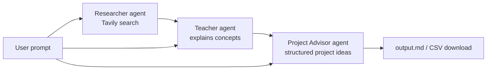

# CrewAI + Groq Demo

A project exploring agentic AI with [CrewAI](https://www.crewai.com/), using
[Groq](https://groq.com/) as the LLM provider to stay on free-tier usage
instead of paid APIs. It runs a small crew of agents — researcher, teacher,
and project advisor — that hand results to each other to turn a plain-English
question into a set of concrete agentic-AI project ideas.

## What it does

You ask a question like *"What can I build with agentic AI as an
entrepreneur?"* and three agents work through it in sequence:

1. **Researcher** — searches the web (via Tavily) for current, relevant
   findings and summarizes them with sources.
2. **Teacher** — explains the agentic-AI concepts relevant to your specific
   question, grounded in the research.
3. **Project Advisor** — turns that explanation into a structured list of
   project ideas, each with a goal, KPI, recommended package, and rationale.

Each stage is gated behind a manual step (a button in the UI, a y/N prompt in
the CLI) so you decide when to spend an API call, rather than the app
burning through them automatically.

## Demo

🚧 Under construction — no screenshots or demo GIF yet.

## Architecture



Each agent runs as its own single-task `Crew` (see `run_research`,
`run_teaching`, `run_project` in
[crewai_groq_demo/crew.py](crewai_groq_demo/crew.py)), so a stage only runs
when explicitly triggered, and the caller decides what gets passed forward.

```
crewai_groq_demo/
  crew.py                 # LLM setup, per-agent Crew runners
  models.py                # Pydantic schema for project ideas
  config/
    agents.yaml            # role/goal/backstory per agent
    tasks.yaml              # description/expected_output per task
  tools/
    counting_tavily_search_tool.py  # Tavily search wrapper that tracks call count/queries
main.py                    # CLI entry point
app.py                     # Streamlit UI entry point
```

## Setup

This project is managed entirely with [`uv`](https://docs.astral.sh/uv/) —
no manual `.venv` activation needed.

```bash
uv sync
```

### Required environment variables

Create a `.env` file in the project root (not committed) with:

| Variable | Used by | Get one at |
|---|---|---|
| `GROQ_API_KEY` | teacher, project advisor, researcher LLM calls | [console.groq.com](https://console.groq.com/) |
| `TAVILY_API_KEY` | researcher's web search tool | [tavily.com](https://tavily.com/) |

Both are required — `crew.py` raises immediately if either is missing.

### Running

```bash
uv run main.py                    # CLI
uv run streamlit run app.py       # Streamlit UI
```

## Example prompts

- "What can I build with agentic AI as an entrepreneur?"
- "Explain agentic AI to a solo SaaS founder in 3 points."
- "How could a small marketing agency use agentic AI? Give me 5 ideas."

The teacher and project advisor tailor depth, framing, and idea count to
whatever audience/domain/count you specify in the prompt.

## Example output

Given *"What can I build with agentic AI as an entrepreneur?"*, the project
advisor produces structured ideas like:

```markdown
## Client Onboarding Concierge

- **Goal:** Automatically gather, verify, and summarize new-client intake
  documents into a ready-to-review packet.
- **KPI:** Time from signed contract to fully verified client file.
- **Package:** CrewAI
- **Why this package:** Config-driven, sequential agent roles map cleanly
  onto a fixed intake checklist.
```

The Streamlit UI renders each idea as a card and also offers a CSV download;
the CLI writes the full set to `output.md`.

## Cost estimate per run

Both providers have usable free tiers, so a full run (research + teacher +
project advisor) typically costs **$0**:

- **Groq**: `llama-3.3-70b-versatile` is available on Groq's free tier,
  subject to requests/tokens-per-minute rate limits. Three short calls per
  run (one per agent) stays well within them for occasional use.
- **Tavily**: the researcher makes at most 2 searches per run (capped in
  `tasks.yaml`), well within Tavily's free monthly search quota.

If you exceed free-tier rate limits, Groq/Tavily calls will fail with a
429-style error rather than silently charging you — neither provider is
configured with a paid fallback here.

## Deployment

🚧 Under construction — no deployment target has been chosen yet.

## How it works

- **Config-driven agents/tasks**: roles, goals, and backstories live in
  [config/agents.yaml](crewai_groq_demo/config/agents.yaml); task prompts
  and expected outputs live in
  [config/tasks.yaml](crewai_groq_demo/config/tasks.yaml). `crew.py` wires
  them together rather than hardcoding prompts in Python.
- **Structured output**: the project advisor's task uses
  `output_pydantic=ProjectIdeaList`, so its output is validated, typed data
  (not markdown that needs parsing) — see
  [models.py](crewai_groq_demo/models.py).
- **Search accountability**: `CountingTavilySearchTool` wraps CrewAI's
  Tavily tool to track exactly how many searches ran and what was searched,
  so the UI can warn you if the researcher used more than one search or
  hallucinated findings without searching at all.
- **Retry on malformed tool calls**: `run_research` rebuilds the agent/crew
  from scratch and retries (up to 3 attempts) if Groq's tool-calling output
  is malformed, without letting a failed attempt's search count or
  conversation state bleed into the retry.
- **Groq/CrewAI workaround**: `crew.py` monkey-patches CrewAI's
  `mark_cache_breakpoint` to a no-op, working around a CrewAI↔Groq
  incompatibility (Groq rejects a `cache_breakpoint` field CrewAI adds to
  messages). See the comment in `crew.py` before removing it.

## Roadmap

🚧 Under construction — no formal roadmap yet.

## Use cases

🚧 Under construction.
