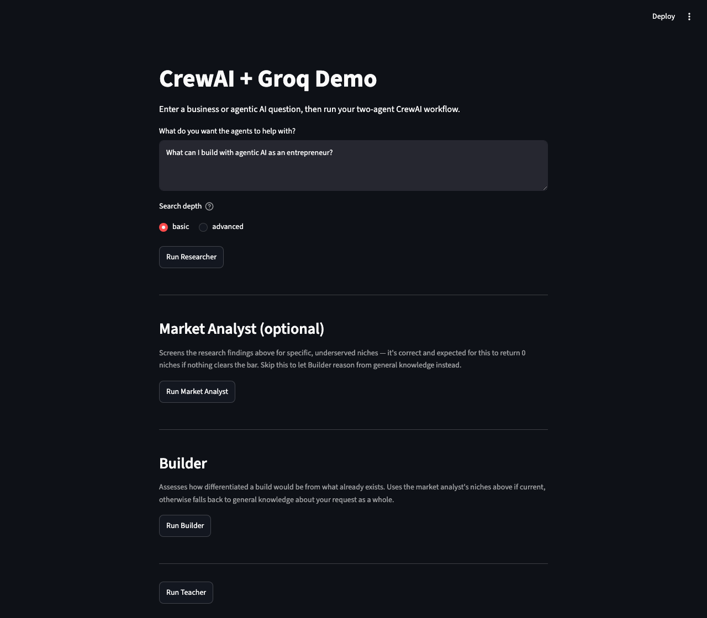
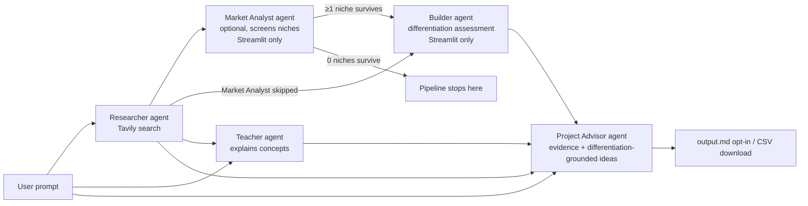

# CrewAI + Groq Demo

A project exploring agentic AI with [CrewAI](https://www.crewai.com/), using
[Groq](https://groq.com/) as the LLM provider to stay on free-tier usage
instead of paid APIs. It runs a small crew of agents that hand results to
each other to turn a plain-English question into a set of concrete
agentic-AI project ideas.

## What it does

You ask a question like *"What can I build with agentic AI as an
entrepreneur?"* and a chain of agents work through it:

1. **Researcher** — searches the web (via Tavily) for current, relevant
   findings and summarizes them with sources.
2. **Market Analyst** (Streamlit UI only, optional) — screens those findings
   for specific, underserved niches, actively rejecting broad or saturated
   candidates. It's correct and expected for this to return 0 niches if
   nothing clears the bar — the pipeline stops there rather than proceeding.
3. **Builder** (Streamlit UI only) — assesses how differentiated a build
   would be from existing agentic-AI solutions, either per-niche (if Market
   Analyst ran and found any) or for the request as a whole (if it didn't).
4. **Teacher** — explains the agentic-AI concepts relevant to your specific
   question, grounded in the research.
5. **Project Advisor** — turns that explanation into a structured list of
   project ideas, each with a goal, KPI, recommended package, and rationale
   — grounded in the research findings themselves (not just the teacher's
   paraphrase) and, if available, the builder's differentiation assessment
   — with cited evidence, a confidence level, and open validation questions
   per idea.

In the Streamlit UI, each stage is gated behind a manual button so you
decide when to spend an API call rather than the app burning through them
automatically. The CLI currently only runs the original three-stage
pipeline (researcher → teacher → project advisor) non-interactively (see
`--research`/`--output` below) — Market Analyst and Builder aren't wired
into it yet.

## Demo



## Architecture



Each agent runs as its own single-task `Crew` (see `run_research`,
`run_market_analysis`, `run_builder`, `run_teaching`, `run_project` in
[crewai_groq_demo/crew.py](crewai_groq_demo/crew.py)), so a stage only runs
when explicitly triggered, and the caller decides what gets passed forward.
Market Analyst and Builder are currently wired into the Streamlit UI only —
see "What it does" above.

```
crewai_groq_demo/
  crew.py                 # LLM setup, per-agent Crew runners
  models.py                # Pydantic schema for project ideas
  settings.py               # Typed, validated env config (pydantic-settings)
  cost.py                    # Groq/Tavily cost estimation from token usage
  exceptions.py              # Typed exceptions (MissingAPIKeyError, RateLimitError, ...)
  config/
    agents.yaml            # role/goal/backstory per agent
    tasks.yaml              # description/expected_output per task
  tools/
    counting_tavily_search_tool.py  # Tavily search wrapper that tracks call count/queries
main.py                    # CLI entry point
app.py                     # Streamlit UI entry point
tests/                      # pytest suite (no live API calls — see Testing)
```

## Setup

This project is managed entirely with [`uv`](https://docs.astral.sh/uv/) —
no manual `.venv` activation needed.

```bash
uv sync
```

### Required environment variables

Create a `.env` file in the project root (not committed) with:

| Variable | Used by | Get one at |
|---|---|---|
| `GROQ_API_KEY` | all agent LLM calls (researcher, market analyst, builder, teacher, project advisor) | [console.groq.com](https://console.groq.com/) |
| `TAVILY_API_KEY` | researcher's web search tool | [tavily.com](https://tavily.com/) |

Both are required — `crew.py` raises a `MissingAPIKeyError` immediately if
either is missing, caught in `app.py`/`main.py` and shown as a clean message
rather than a stack trace.

### Running

```bash
# Streamlit UI — gated buttons, review before each API call
uv run streamlit run app.py

# CLI — runs teacher + project advisor non-interactively; flags opt into extras
uv run python main.py "What can I build for real estate agents?"
uv run python main.py "What can I build for real estate agents?" --research
uv run python main.py "What can I build for real estate agents?" --research --search-depth advanced
uv run python main.py "What can I build for real estate agents?" --research --output output.md
```

`--research` runs the researcher (Tavily) first; `--search-depth
{basic,advanced}` controls Tavily's search depth (advanced costs 2x the
credits of basic; defaults to the `TAVILY_SEARCH_DEPTH` setting); `--output
PATH` writes the project ideas as markdown to PATH (omit it and nothing is
written to disk).

## Testing

```bash
uv run pytest      # run the test suite
uv run ruff check . # lint
uv run mypy crewai_groq_demo    # type-check
```

The test suite never calls Groq or Tavily — every test that touches
`run_research`/`run_teaching`/`run_project` mocks `Crew.kickoff` and scripts
its return value/exception, so tests run in milliseconds, for free, and
don't need a real `.env`. Coverage so far focuses on what's testable without
a live LLM in the loop:

- `models.py` — `ProjectIdeaList.to_markdown()`/`ProjectIdea.to_markdown_block()`
  formatting (evidence/confidence/open-questions), `MarketAnalysis.to_niches_text()`,
  and `BuildPlan.to_builder_text()`
- `exceptions.py` — message formatting and attributes on each typed error
- `settings.py` — env var loading, defaults, and `get_settings()` caching
  (including Tavily's `max_results`/`search_depth`)
- `cost.py` — Groq/Tavily cost estimation math and the "cost unavailable"
  fallback (kept as a defensive guard; no task currently hits it — see
  "Structured output" below)
- `structured_output.py` — JSON parsing/fence-stripping for the project
  advisor's, market analyst's, and builder's structured outputs
- `tools/counting_tavily_search_tool.py` — call-count/query tracking
- `crew.py`'s `run_research` retry loop — first-try success, retry-then-
  succeed, retries exhausted, Groq rate-limit handling, the exponential
  backoff between retries, token-usage accumulation, and the same-process
  research cache (now keyed on `(prompt, search_depth)`)
- `crew.py`'s `test_researcher_instance_matches_task_resolved_agent` — a
  genuine (non-mocked) regression test for a real bug caught via live
  Tavily-dashboard verification: giving `researcher()` a `search_depth`
  kwarg broke object identity between CrewAI's own internal agent
  resolution (`GroqDemoCrew.__init__` eagerly resolves `tasks.yaml`'s
  `agent: researcher` via a zero-arg call, memoized by exact args) and
  ours, so the instance we inspected for search counts was never actually
  the one CrewAI executed. Fixed by moving `search_depth` onto
  `GroqDemoCrew.__init__` so every call to `researcher()` stays args-
  identical. **The rest of the mocked test suite structurally cannot catch
  this class of bug** — those tests mock `Crew.kickoff` itself, so they
  never exercise CrewAI's real task-agent resolution.
- `crew.py`'s `run_teaching`/`run_project` — usage returned alongside each
  result, `output.md` only written when `output_path` is given, confidence
  forced to `"low"` when no research was run, `builder_result` passed
  through to `project_task`'s inputs (defaulting to `NO_BUILDER_TEXT` when
  Builder didn't run), and `run_teaching`'s single rate-limit retry
  (succeeds using Groq's reported retry-after, gives up after one retry on
  a persistent limit, gives up immediately on TPD/RPD)
- `structured_output.py`'s `parse_structured_output` — clean JSON, JSON
  wrapped in markdown fences, JSON with surrounding prose, and both
  malformed-JSON and schema-mismatch failures
- `crew.py`'s `_kickoff_with_structured_output` (via `run_builder`) — retry-
  then-succeed on malformed JSON, retries exhausted, retry-then-succeed on
  a TPM/RPM rate limit using Groq's reported retry-after, retries exhausted
  when unparseable, and immediate give-up on TPD/RPD
- `crew.py`'s agent construction — `teacher`/`project_advisor`/
  `market_analyst`/`builder` all cap `max_iter=1`
  (`test_crew_agent_iteration_limits.py`)

`ruff` and `mypy` are configured in `pyproject.toml`
(`select = ["E", "F", "I", "UP", "B"]` for ruff; fairly strict mypy with a
scoped `ignore_missing_imports` for `tavily.*`, the only direct dependency
without inline type stubs). Note: `crew.py` currently has a chunk of
pre-existing mypy noise from CrewAI's `@CrewBase`/`@agent`/`@task` decorator
magic (e.g. `self.agents_config["teacher"]` type-checking as indexing a
plain `str`) — not yet resolved, tracked as a follow-up rather than papered
over with blanket `# type: ignore`s.

## Example prompts

- "What can I build with agentic AI as an entrepreneur?"
- "Explain agentic AI to a solo SaaS founder in 3 points."
- "How could a small marketing agency use agentic AI? Give me 5 ideas."

The teacher and project advisor tailor depth, framing, and idea count to
whatever audience/domain/count you specify in the prompt.

## Example output

Given *"How could a small marketing agency use agentic AI?"* with
`--research`, the project advisor produces structured ideas like:

```markdown
## Automated Customer Journeys

- **Goal:** Orchestrate customer journeys in real-time, enabling autonomous
  adaptation and optimization of campaigns.
- **KPI:** Increased engagement and conversion rates.
- **Package:** CrewAI
- **Why this package:** Enables AI-powered workflows that automatically
  adjust to individual customer behaviors.
- **Why this niche:** Utilizes agentic AI to automate workflows and scale
  personalization, as seen in Adobe's AI for Business.
- **Confidence:** high
- **Evidence:**
  - Agentic AI can be used by small marketing agencies to automate
    workflows and scale personalization: https://business.adobe.com/ai/agentic-ai-for-marketing.html
- **Open questions:**
  - What specific customer journey touchpoints would be automated?
```

Skip `--research` and the same idea instead comes back with `confidence:
low` and `- **Evidence:** none — no research was run for this idea` — forced
in code (`run_project` in `crew.py`), not left to the model to self-report.

The Streamlit UI renders each idea as a card (with evidence/open-questions
in expanders) and also offers a CSV download; the CLI prints the same to
stdout and writes it to disk only if you pass `--output PATH`. The
Streamlit UI also renders Market Analyst's niches and Builder's
differentiation assessments as their own cards, each with a per-stage cost
caption, between the researcher and teacher sections.

## Cost estimate per run

Both providers have usable free tiers, so a full run typically costs **$0**
— three calls (research + teacher + project advisor) via the CLI, or up to
five in the Streamlit UI if you opt into Market Analyst and Builder too:

- **Groq**: `openai/gpt-oss-120b` is available on Groq's free tier, subject
  to a fairly tight 8K-tokens-per-minute burst limit — running all five
  Streamlit stages back-to-back with no pause between clicks can hit it.
  Every stage now retries once, waiting however long Groq's own error says
  is actually needed (capped at 30s) before giving up — most rate limits
  become a slightly slower success rather than a hard failure. If it still
  fails, the app shows a clean message — e.g. `Rate limited by groq (TPM
  limit). Retry after 29.6s.` — rather than crashing or showing a bare
  "rate limited" with no indication of how long to wait. This is the second
  model tried here — see "Model history" below for what didn't work and why.
- **Tavily**: the researcher makes at most 2 searches per run (capped in
  `tasks.yaml`), well within Tavily's free monthly search quota. `advanced`
  search depth costs 2 credits/search vs. 1 for `basic` (Tavily's own
  pricing, not a guess — see `cost.py`); this project defaults to `basic`.

The app estimates real cost per run, using each call's actual Groq token
usage (`crew.usage_metrics`) and Tavily's per-search pricing — see
`cost.py`. Both the CLI and Streamlit UI print/show this per stage.
Repeating the same research prompt within one process (e.g. re-running the
Streamlit app without changing the prompt) skips Tavily/Groq entirely via an
in-memory cache, and shows as `$0` since no call was actually made.

### Model history

- `llama-3.3-70b-versatile` was the original default. Groq has scheduled it
  for deprecation on **2026-08-16**, recommending `openai/gpt-oss-120b` or
  `qwen/qwen3.6-27b` as replacements — see
  [console.groq.com/docs/deprecations](https://console.groq.com/docs/deprecations).
- `llama-3.1-8b-instant` was tried for its larger published daily quota, but
  its real per-minute limit on this account turned out to be tighter than
  the 70B model's — tight enough that a single back-to-back run could hit
  it — so it was reverted.
- `qwen/qwen3-32b` and `meta-llama/llama-4-scout-17b-16e-instruct` both
  failed outright on CrewAI's `output_pydantic`/`InternalInstructor`
  structured-output path (a Groq `tool_use_failed` error), even though
  plain-text generation worked fine on both.
- `openai/gpt-oss-120b` hit the same class of failure at first (Groq
  rejected a tool call to an undeclared `"json"` tool — a known quirk of
  gpt-oss's own "Harmony" response format leaking through). Rather than
  keep hunting for a model that happened to be compatible with that path,
  structured output was switched to plain JSON-in-text + manual parsing
  (`structured_output.py`) — see "Structured output" below. That fix is
  portable across models, not specific to gpt-oss, and also fixed the
  "cost unavailable" issue below since normal text generation *does* track
  token usage.

If you exceed free-tier rate limits, Groq/Tavily calls will fail with a
429-style error rather than silently charging you — neither provider is
configured with a paid fallback here.

## Deployment

🚧 Under construction — no deployment target has been chosen yet.

## How it works

- **Config-driven agents/tasks**: roles, goals, and backstories live in
  [config/agents.yaml](crewai_groq_demo/config/agents.yaml); task prompts
  and expected outputs live in
  [config/tasks.yaml](crewai_groq_demo/config/tasks.yaml). `crew.py` wires
  them together rather than hardcoding prompts in Python.
- **Structured output**: the project advisor, market analyst, and builder
  tasks are prompted to emit a raw JSON object matching their Pydantic
  model, then parsed/validated by hand in
  [structured_output.py](crewai_groq_demo/structured_output.py) — not via
  CrewAI's `output_pydantic`/`InternalInstructor`, which forces structured
  output through Groq's tool-calling protocol. That protocol's reliability
  varies a lot per model (confirmed broken on 3 of the 4 non-default models
  tried — see "Model history" above), while plain-text generation works
  everywhere. `crew.py`'s `_kickoff_with_structured_output` retries (same
  backoff as the researcher) if a response doesn't parse. See
  [models.py](crewai_groq_demo/models.py) for the schemas themselves.
- **Search accountability**: `CountingTavilySearchTool` wraps CrewAI's
  Tavily tool to track exactly how many searches ran and what was searched,
  so the UI can warn you if the researcher used more than one search or
  hallucinated findings without searching at all.
- **Retry on malformed tool calls or Groq rate limits**: `run_research`
  rebuilds the agent/crew from scratch and retries (up to 3 attempts, with
  exponential backoff) if Groq's tool-calling output is malformed or Groq
  rate-limits the request, without letting a failed attempt's search count
  or conversation state bleed into the retry. (Tavily rate limits aren't
  cleanly catchable here — CrewAI's tool-execution layer swallows them into
  agent-visible text before they'd reach this code.)
- **Actionable rate-limit messages**: `crew.py`'s `_parse_groq_rate_limit`
  extracts the retry-after seconds and limit type (TPM/RPM/TPD/RPD) straight
  out of Groq's own error text and threads them into `RateLimitError`, so
  the CLI/Streamlit UI show e.g. `Rate limited by groq (TPM limit). Retry
  after 29.6s.` instead of a bare `Rate limited by groq.` with no way to
  tell a 5-second hiccup from a longer block. Falls back to the bare
  message if Groq's wording doesn't match (not a stable contract).
- **Rate limits are retried everywhere, not just in research**: all five
  stages now wait for Groq's real reported retry-after (capped at 30s)
  before giving up on a TPM/RPM hit — `_kickoff_with_structured_output`
  (project advisor, market analyst, builder) retries it within its existing
  parse-retry loop; `run_teaching` gets a single retry-then-raise. A TPD/RPD
  (daily) limit gives up immediately in all cases, since no wait within a
  single call clears it.
- **Capped agent iteration budgets**: `teacher`, `project_advisor`,
  `market_analyst`, and `builder` all set `max_iter=1` — none of them use
  tools, so they should resolve in one pass. CrewAI's default (25) meant an
  unrecognized "final answer" could silently trigger up to 25 real,
  token-consuming Groq calls per task before ever reaching this codebase's
  error handling; confirmed only `researcher` (which needs a couple of
  tool-call iterations, so keeps `max_iter=3`) had this constrained before.
  Note this is a different, more impactful mechanism than CrewAI's
  `max_retry_limit`, which doesn't apply here — `litellm`-raised exceptions
  (both `RateLimitError` and `tool_use_failed`) bypass that retry entirely
  and re-raise immediately (confirmed in CrewAI's
  `agent/core.py::_check_execution_error`).
- **Typed config and errors**: `settings.py` (`pydantic-settings`) replaces
  scattered `os.getenv()` calls with a validated settings object;
  `exceptions.py` defines `MissingAPIKeyError`, `RateLimitError`, and
  `ResearchRetryExhaustedError` so callers handle failures by type instead
  of pattern-matching error strings.
- **Groq/CrewAI workaround**: `crew.py` monkey-patches CrewAI's
  `mark_cache_breakpoint` to a no-op, working around a CrewAI↔Groq
  incompatibility (Groq rejects a `cache_breakpoint` field CrewAI adds to
  messages). See the comment in `crew.py` before removing it.
- **Market Analyst → Builder gating (Streamlit only)**: Market Analyst is
  optional and actively screens niches — it's correct for it to return zero.
  `app.py` enforces the "stops here" rule from that outcome: if Market
  Analyst ran and found nothing, clicking "Run Builder" shows an info
  message instead of spending a Groq call on niches that didn't survive
  screening. If Market Analyst was skipped (or is stale for the current
  prompt) entirely, Builder falls back to general knowledge as normal.
- **CrewAI task-agent resolution gotcha**: `GroqDemoCrew.__init__` eagerly
  resolves `tasks.yaml`'s `agent: <name>` strings by calling the matching
  `@agent` method with **zero arguments**, and memoizes by exact call args.
  Any `@agent` method that takes a parameter (like `researcher`'s
  `search_depth` used to) must have that parameter come from constructor
  state instead, read by a zero-arg call — otherwise CrewAI silently builds
  and executes a *different* instance than the one your own code holds and
  inspects. Caught live: our own search-count tracking read 0 while
  Tavily's dashboard showed 2 real searches happened. See the comment on
  `GroqDemoCrew.__init__` and `run_research`'s `search_tool =
  research_task.agent.tools[0]` line before adding a parameter to
  `teacher`/`project_advisor`/`researcher`.
- **Evidence-grounded ideas**: `project_task` receives the researcher's raw
  findings directly (not just the teacher's paraphrase of them), and must
  cite specific findings by URL per idea rather than reach for general
  knowledge. `run_project` forces every idea's `confidence` to `"low"` when
  no research was run, rather than trusting the model to self-report it.
- **Cost tracking**: each agent call returns its `crew.usage_metrics`
  alongside the result; `cost.py` turns that into an estimated dollar
  amount using named pricing constants in `settings.py`. Repeat research
  prompts are served from an in-process cache (`crew.py`'s
  `_research_cache`) instead of re-hitting Tavily/Groq.

## Roadmap

🚧 Under construction — no formal roadmap yet.

## Use cases

🚧 Under construction.
