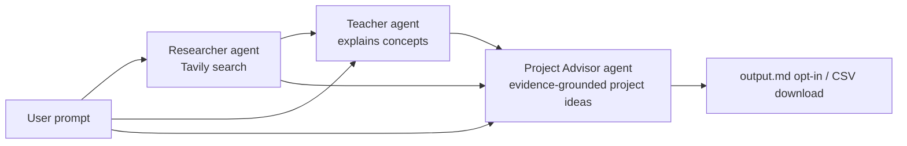

# CrewAI + Groq Demo

A project exploring agentic AI with [CrewAI](https://www.crewai.com/), using
[Groq](https://groq.com/) as the LLM provider to stay on free-tier usage
instead of paid APIs. It runs a small crew of agents — researcher, teacher,
and project advisor — that hand results to each other to turn a plain-English
question into a set of concrete agentic-AI project ideas.

## What it does

You ask a question like *"What can I build with agentic AI as an
entrepreneur?"* and three agents work through it in sequence:

1. **Researcher** — searches the web (via Tavily) for current, relevant
   findings and summarizes them with sources.
2. **Teacher** — explains the agentic-AI concepts relevant to your specific
   question, grounded in the research.
3. **Project Advisor** — turns that explanation into a structured list of
   project ideas, each with a goal, KPI, recommended package, and rationale
   — grounded in the research findings themselves (not just the teacher's
   paraphrase), with cited evidence, a confidence level, and open validation
   questions per idea.

In the Streamlit UI, each stage is gated behind a manual button so you
decide when to spend an API call rather than the app burning through them
automatically. The CLI runs non-interactively (see `--research`/`--output`
below) — research is opt-in per invocation, and the teacher/project-advisor
calls always run since that's the point of scripting it.

## Demo

🚧 Under construction — no screenshots or demo GIF yet.

## Architecture



Each agent runs as its own single-task `Crew` (see `run_research`,
`run_teaching`, `run_project` in
[crewai_groq_demo/crew.py](crewai_groq_demo/crew.py)), so a stage only runs
when explicitly triggered, and the caller decides what gets passed forward.

```
crewai_groq_demo/
  crew.py                 # LLM setup, per-agent Crew runners
  models.py                # Pydantic schema for project ideas
  settings.py               # Typed, validated env config (pydantic-settings)
  cost.py                    # Groq/Tavily cost estimation from token usage
  exceptions.py              # Typed exceptions (MissingAPIKeyError, RateLimitError, ...)
  config/
    agents.yaml            # role/goal/backstory per agent
    tasks.yaml              # description/expected_output per task
  tools/
    counting_tavily_search_tool.py  # Tavily search wrapper that tracks call count/queries
main.py                    # CLI entry point
app.py                     # Streamlit UI entry point
tests/                      # pytest suite (no live API calls — see Testing)
```

## Setup

This project is managed entirely with [`uv`](https://docs.astral.sh/uv/) —
no manual `.venv` activation needed.

```bash
uv sync
```

### Required environment variables

Create a `.env` file in the project root (not committed) with:

| Variable | Used by | Get one at |
|---|---|---|
| `GROQ_API_KEY` | teacher, project advisor, researcher LLM calls | [console.groq.com](https://console.groq.com/) |
| `TAVILY_API_KEY` | researcher's web search tool | [tavily.com](https://tavily.com/) |

Both are required — `crew.py` raises a `MissingAPIKeyError` immediately if
either is missing, caught in `app.py`/`main.py` and shown as a clean message
rather than a stack trace.

### Running

```bash
# Streamlit UI — gated buttons, review before each API call
uv run streamlit run app.py

# CLI — runs teacher + project advisor non-interactively; flags opt into extras
uv run python main.py "What can I build for real estate agents?"
uv run python main.py "What can I build for real estate agents?" --research
uv run python main.py "What can I build for real estate agents?" --research --output output.md
```

`--research` runs the researcher (Tavily) first; `--output PATH` writes the
project ideas as markdown to PATH (omit it and nothing is written to disk).

## Testing

```bash
uv run pytest      # run the test suite
uv run ruff check . # lint
uv run mypy crewai_groq_demo    # type-check
```

The test suite never calls Groq or Tavily — every test that touches
`run_research`/`run_teaching`/`run_project` mocks `Crew.kickoff` and scripts
its return value/exception, so tests run in milliseconds, for free, and
don't need a real `.env`. Coverage so far focuses on what's testable without
a live LLM in the loop:

- `models.py` — `ProjectIdeaList.to_markdown()`/`ProjectIdea.to_markdown_block()`
  formatting, including the evidence/confidence/open-questions fields
- `exceptions.py` — message formatting and attributes on each typed error
- `settings.py` — env var loading, defaults, and `get_settings()` caching
  (including Tavily's `max_results`/`search_depth`)
- `cost.py` — Groq/Tavily cost estimation math and the "cost unavailable"
  fallback for structured-output calls CrewAI doesn't track usage for
- `tools/counting_tavily_search_tool.py` — call-count/query tracking
- `crew.py`'s `run_research` retry loop — first-try success, retry-then-
  succeed, retries exhausted, Groq rate-limit handling, the exponential
  backoff between retries, token-usage accumulation, and the same-process
  research cache
- `crew.py`'s `run_teaching`/`run_project` — usage returned alongside each
  result, `output.md` only written when `output_path` is given, and
  confidence forced to `"low"` when no research was run

`ruff` and `mypy` are configured in `pyproject.toml`
(`select = ["E", "F", "I", "UP", "B"]` for ruff; fairly strict mypy with a
scoped `ignore_missing_imports` for `tavily.*`, the only direct dependency
without inline type stubs). Note: `crew.py` currently has a chunk of
pre-existing mypy noise from CrewAI's `@CrewBase`/`@agent`/`@task` decorator
magic (e.g. `self.agents_config["teacher"]` type-checking as indexing a
plain `str`) — not yet resolved, tracked as a follow-up rather than papered
over with blanket `# type: ignore`s.

## Example prompts

- "What can I build with agentic AI as an entrepreneur?"
- "Explain agentic AI to a solo SaaS founder in 3 points."
- "How could a small marketing agency use agentic AI? Give me 5 ideas."

The teacher and project advisor tailor depth, framing, and idea count to
whatever audience/domain/count you specify in the prompt.

## Example output

Given *"How could a small marketing agency use agentic AI?"* with
`--research`, the project advisor produces structured ideas like:

```markdown
## Automated Customer Journeys

- **Goal:** Orchestrate customer journeys in real-time, enabling autonomous
  adaptation and optimization of campaigns.
- **KPI:** Increased engagement and conversion rates.
- **Package:** CrewAI
- **Why this package:** Enables AI-powered workflows that automatically
  adjust to individual customer behaviors.
- **Why this niche:** Utilizes agentic AI to automate workflows and scale
  personalization, as seen in Adobe's AI for Business.
- **Confidence:** high
- **Evidence:**
  - Agentic AI can be used by small marketing agencies to automate
    workflows and scale personalization: https://business.adobe.com/ai/agentic-ai-for-marketing.html
- **Open questions:**
  - What specific customer journey touchpoints would be automated?
```

Skip `--research` and the same idea instead comes back with `confidence:
low` and `- **Evidence:** none — no research was run for this idea` — forced
in code (`run_project` in `crew.py`), not left to the model to self-report.

The Streamlit UI renders each idea as a card (with evidence/open-questions
in expanders) and also offers a CSV download; the CLI prints the same to
stdout and writes it to disk only if you pass `--output PATH`.

## Cost estimate per run

Both providers have usable free tiers, so a full run (research + teacher +
project advisor) typically costs **$0**:

- **Groq**: `llama-3.3-70b-versatile` is available on Groq's free tier,
  subject to requests/tokens-per-minute rate limits. Three short calls per
  run (one per agent) stays well within them for occasional use.
- **Tavily**: the researcher makes at most 2 searches per run (capped in
  `tasks.yaml`), well within Tavily's free monthly search quota.

The app estimates real cost per run, using each call's actual Groq token
usage (`crew.usage_metrics`) and Tavily's per-search pricing — see
`cost.py`. Both the CLI and Streamlit UI print/show this per stage. One
caveat: the project advisor uses `output_pydantic` for structured output,
and CrewAI doesn't track token usage for that code path, so its cost always
shows as "unavailable" rather than a (misleading) `$0` — a confirmed CrewAI
limitation, not a bug here. Repeating the same research prompt within one
process (e.g. re-running the Streamlit app without changing the prompt)
skips Tavily/Groq entirely via an in-memory cache, and shows as `$0` since
no call was actually made.

If you exceed free-tier rate limits, Groq/Tavily calls will fail with a
429-style error rather than silently charging you — neither provider is
configured with a paid fallback here.

## Deployment

🚧 Under construction — no deployment target has been chosen yet.

## How it works

- **Config-driven agents/tasks**: roles, goals, and backstories live in
  [config/agents.yaml](crewai_groq_demo/config/agents.yaml); task prompts
  and expected outputs live in
  [config/tasks.yaml](crewai_groq_demo/config/tasks.yaml). `crew.py` wires
  them together rather than hardcoding prompts in Python.
- **Structured output**: the project advisor's task uses
  `output_pydantic=ProjectIdeaList`, so its output is validated, typed data
  (not markdown that needs parsing) — see
  [models.py](crewai_groq_demo/models.py).
- **Search accountability**: `CountingTavilySearchTool` wraps CrewAI's
  Tavily tool to track exactly how many searches ran and what was searched,
  so the UI can warn you if the researcher used more than one search or
  hallucinated findings without searching at all.
- **Retry on malformed tool calls or Groq rate limits**: `run_research`
  rebuilds the agent/crew from scratch and retries (up to 3 attempts, with
  exponential backoff) if Groq's tool-calling output is malformed or Groq
  rate-limits the request, without letting a failed attempt's search count
  or conversation state bleed into the retry. (Tavily rate limits aren't
  cleanly catchable here — CrewAI's tool-execution layer swallows them into
  agent-visible text before they'd reach this code.)
- **Typed config and errors**: `settings.py` (`pydantic-settings`) replaces
  scattered `os.getenv()` calls with a validated settings object;
  `exceptions.py` defines `MissingAPIKeyError`, `RateLimitError`, and
  `ResearchRetryExhaustedError` so callers handle failures by type instead
  of pattern-matching error strings.
- **Groq/CrewAI workaround**: `crew.py` monkey-patches CrewAI's
  `mark_cache_breakpoint` to a no-op, working around a CrewAI↔Groq
  incompatibility (Groq rejects a `cache_breakpoint` field CrewAI adds to
  messages). See the comment in `crew.py` before removing it.
- **Evidence-grounded ideas**: `project_task` receives the researcher's raw
  findings directly (not just the teacher's paraphrase of them), and must
  cite specific findings by URL per idea rather than reach for general
  knowledge. `run_project` forces every idea's `confidence` to `"low"` when
  no research was run, rather than trusting the model to self-report it.
- **Cost tracking**: each agent call returns its `crew.usage_metrics`
  alongside the result; `cost.py` turns that into an estimated dollar
  amount using named pricing constants in `settings.py`. Repeat research
  prompts are served from an in-process cache (`crew.py`'s
  `_research_cache`) instead of re-hitting Tavily/Groq.

## Roadmap

🚧 Under construction — no formal roadmap yet.

## Use cases

🚧 Under construction.
